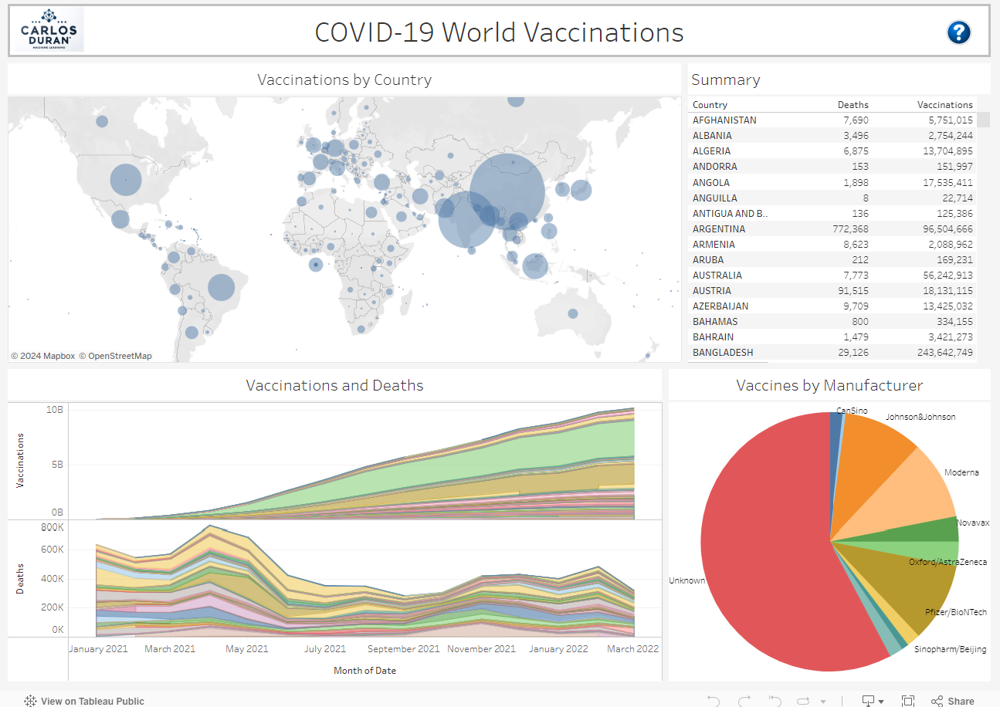

# Interactive Dashboards with Tableau

This repository demonstrates how to create and share interactive data visualizations using Tableau, providing insights into complex datasets. It includes data preprocessing, visualization creation, and dashboard integration.

## Table of Contents

- [Dataset](#dataset)
- [Project Structure](#project-structure)
- [Usage](#usage)
- [Visualization](#visualization)
- [Results](#results)
- [Contributing](#contributing)
- [License](#license)

## Dataset

The datasets used in this project are:
1. **COVID-19 World Vaccination Progress**: Contains information on vaccination progress across various countries.
2. **COVID-19 World Vaccination Progress by Manufacturer**: Contains information on vaccination progress by different manufacturers.
3. **COVID-19 Worldometer Data**: Contains daily information on COVID-19 cases and deaths across various countries.
4. **World Population Data**: Contains information on the total population by country.

### Citation of the Datasets

- Preda, Gabriel. (2021). COVID-19 World Vaccination Progress. Kaggle. https://www.kaggle.com/datasets/gpreda/covid-world-vaccination-progress.
- Preda, Gabriel. (2021). COVID-19 World Vaccination Progress by Manufacturer. Kaggle. https://www.kaggle.com/datasets/gpreda/covid-world-vaccination-progress.
- Joseph Assaker. (2021). COVID-19 Global Dataset. Kaggle. https://www.kaggle.com/datasets/josephassaker/covid19-global-dataset.
- Banerjee, Sourav. (2021). World Population Dataset. Kaggle. https://www.kaggle.com/datasets/iamsouravbanerjee/world-population-dataset.

## Project Structure

```plaintext
Interactive_Dashboards_Tableau/
├── data/
│   ├── country_vaccinations.csv                    # Raw vaccination data
│   ├── country_vaccinations_by_manufacturer.csv    # Raw vaccination by manufacturer data
│   ├── worldometer_coronavirus_daily_data.csv      # Raw worldometer data
│   ├── world_population.csv                        # World population data
│   ├── cleaned_covid_combined_data.csv             # Combined cleaned dataset
├── notebooks/
│   ├── preprocess_show.ipynb                    # Data preprocessing and merging
├── tableau/
│   ├── dashboard.twb                               # Tableau workbook
├── scripts/
│   ├── data_merge.py                               # Data merging script
├── README.md                                       # Project README
```
## Usage

### Data Preprocessing:

- Execute the `preprocess_show.ipynb` notebook to clean, preprocess the data and run an Iframe to look at the dashboard.
- Alternatively, run the `data_merge.py` script to perform data merging.
- [Data Preprocessing Notebook](notebooks/preprocess_show.ipynb)

### Tableau Visualization:

- Open Tableau Desktop or Tableau Public.
- Import the cleaned dataset (`cleaned_covid_combined_data.csv`).
- Create interactive visualizations and dashboards.
- Save the Tableau workbook (`dashboard.twb`).

### Embed Dashboard:

- Publish your Tableau dashboard to Tableau Public.
- Embed the Tableau Public dashboard in your Jupyter Notebook or web application using an iframe.

## Visualization
The visualizations provide insights into:

- The geographical distribution of COVID-19 vaccinations.
- Comparative analysis of vaccination and deaths progress among countries
- Comparative analysis of vaccines by manufacturer

The project explores various interactive visualizations, including:

- **World Map**: Total vaccinations by country.
- **Time Series Chart**: Vaccinations and deaths by country.
- **Pie Chart**: Number of vaccines by manufacturers.

The visualizations are created using Tableau's powerful data visualization tools.

### Interactive Dashboards

You can view the interactive dashboards created with Tableau [here](https://public.tableau.com/shared/3J6YJQFY9?:display_count=n&:origin=viz_share_link).



## Contributing

Contributions are welcome! Please create an issue or submit a pull request for any feature requests or improvements.

## License

This project is licensed under the MIT License.

If you use this repository in your research, please cite it as shown in the right sidebar.


